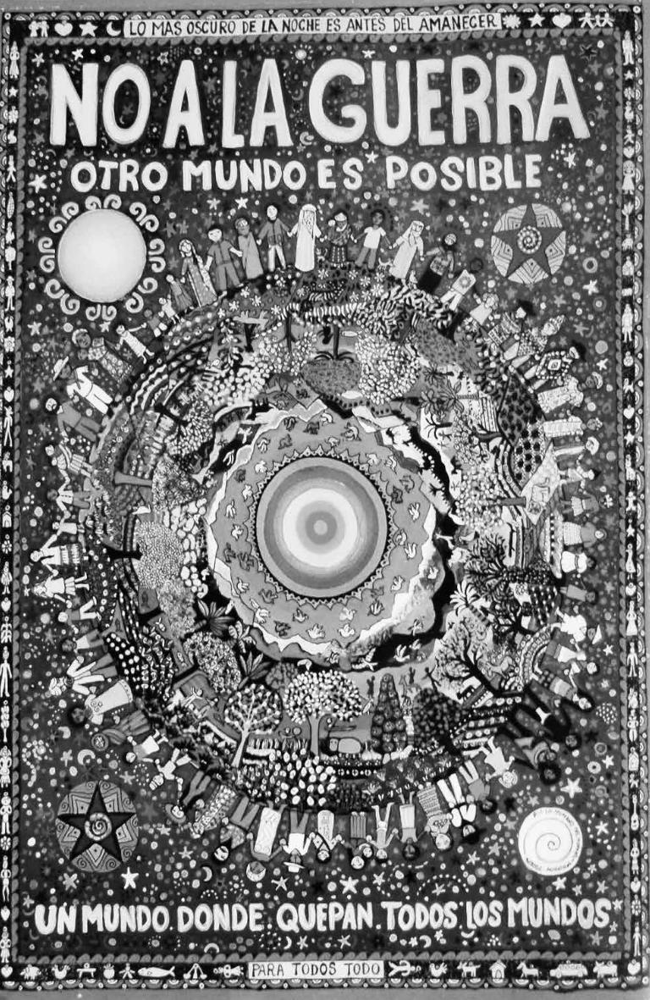
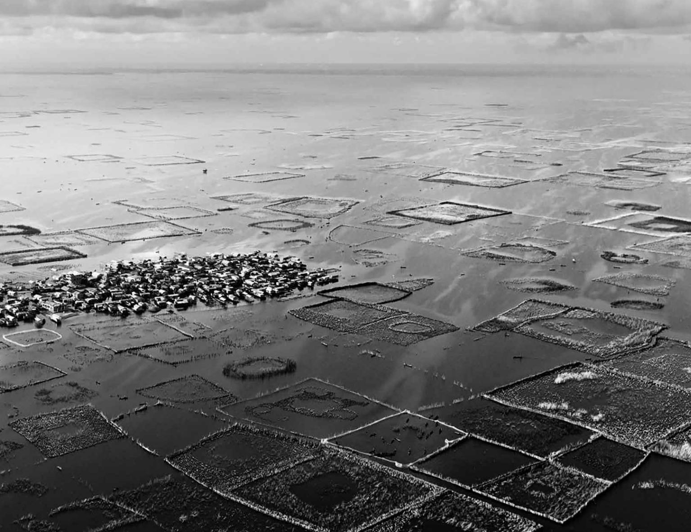
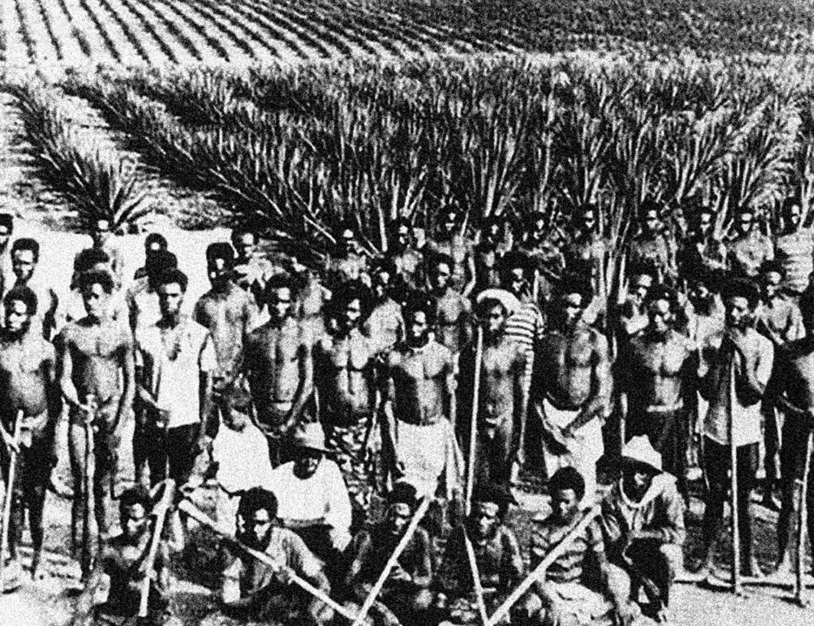
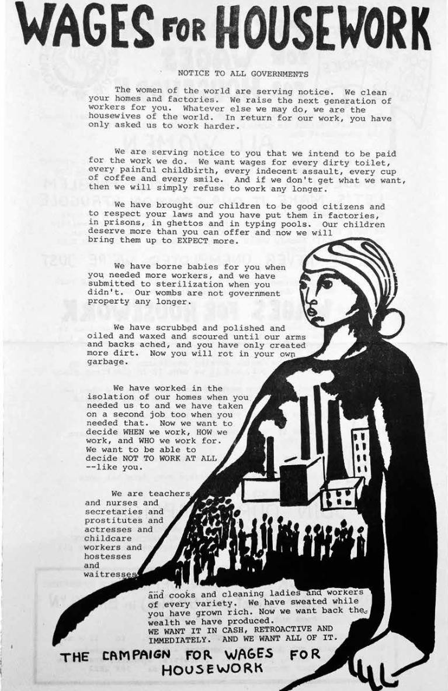
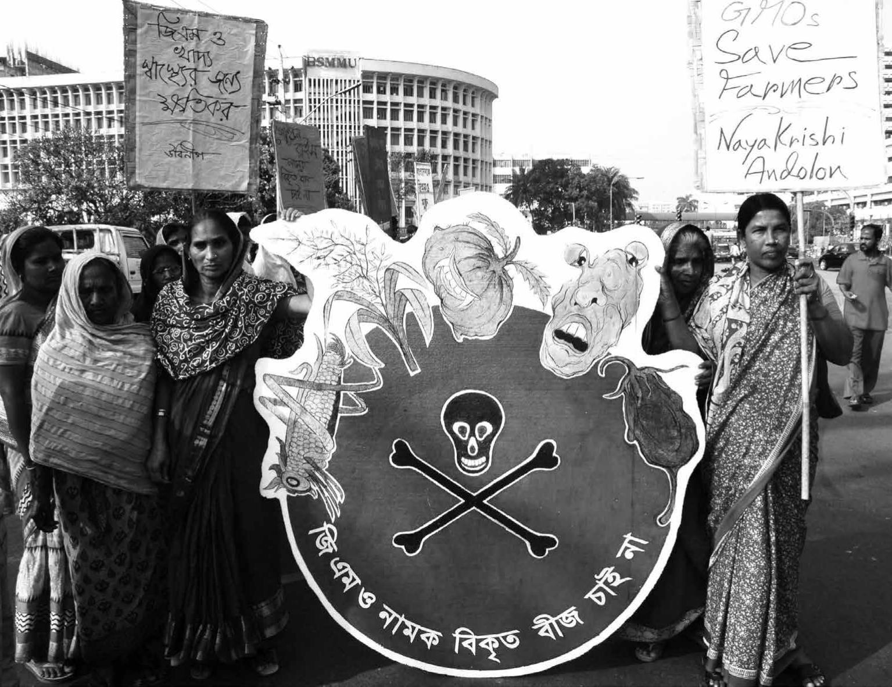
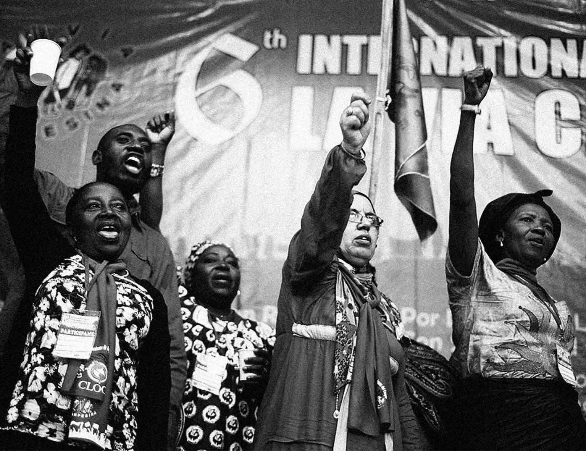
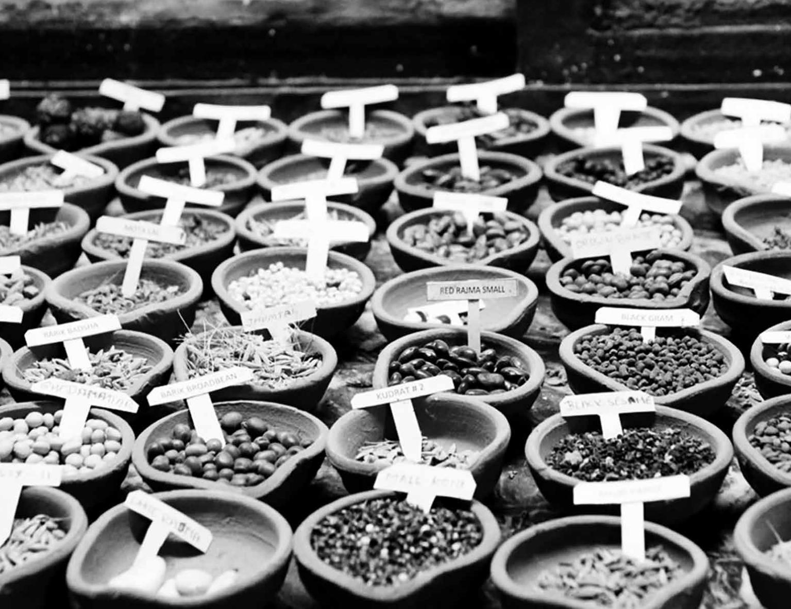
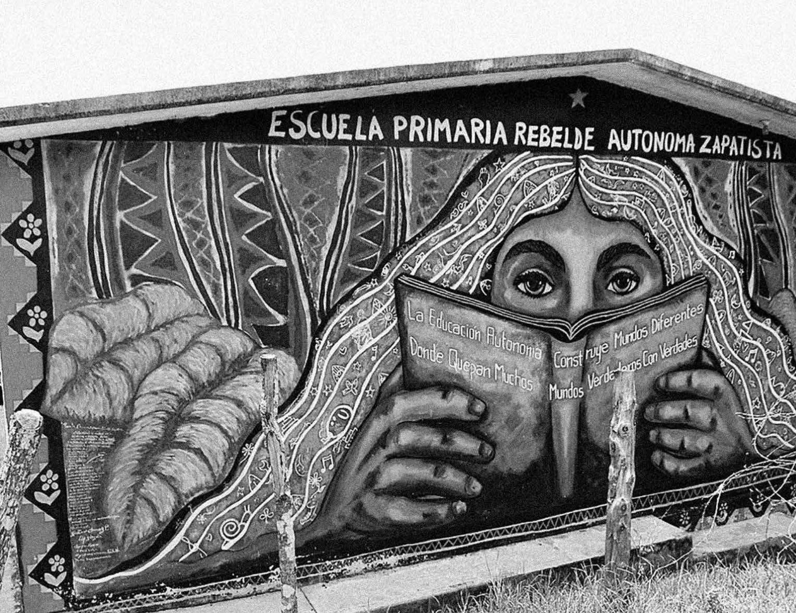

 
« _No a la guerra : otro mundo es posible._ » Dessin de Beatriz Aurora (Mexique).

 
« Acadjas », habitations lacustres et systèmes piscicoles du peuple tofinu (Bénin).

 
Tombe, dans le vieux village de Kasaan (Alaska). 

 
Monastère « Nid du Tigre » (Bhoutan).

 
Kanaks déportés et réduits à l’esclavage dans une plantation de canne à sucre (Australie).

 
En déclarant, lors de son discours d’investiture en 1949, que plus de la moitié de la population mondiale venait de « régions sous-développées », le président Harry Truman a inauguré l’ère du « développement », qui a succédé à l’ère coloniale.

 
Affiche-manifeste de la campagne internationale «Wages For Housework » demandant à l’État de reconnaître et de récompenser économique- ment le travail souvent invisible des femmes (1972) – une initiative du Collectif international féministe cofondé par Silvia Federici.

 
Des femmes du mouvement Nayakrishi Andolon (Le Nouveau Mouvement agricole) en lutte contre les projets d’ogm de Syngenta, Monsanto et d’autres entreprises semencières transnationales. (Bangladesh).

 
6e conférence internationale du mouvement international La Vía Campesina (La voie paysanne) à Jakarta en 2013 (Indonésie).

 
Banque de semences de l’ong Navdanya (fondée par Vandana Shiva) – qui a préservé des centaines de souches de riz, de blé et de nombreuses céréales (Inde).

Slogan de l’École zapatiste : « L’éducation autonome construit des mondes différents faits de multiples mondes véritables pleins de vérités » (Mexique).
